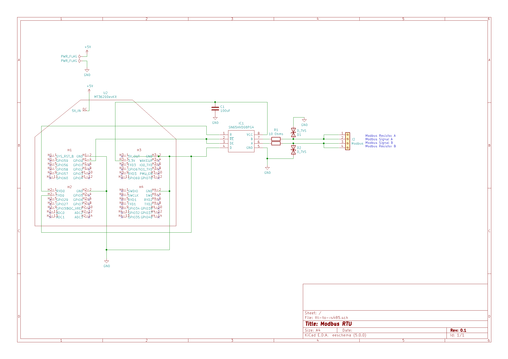

# Modbus on Sphere

## Introduction
Modbus is a well defined communications prototocol used in many applications. It defines a 
message structure that can be transmitted over many different transport layers.
For all Modbus systems there is one master and many slave devices.
The Modbus library has been developed for and tested on the Azure Sphere MT3620 Development Kit.
The most common transport layers are:

### Modbus RTU
Modbus RTU runs over RS485 wiring. Many devices may be connected to the same physical wires, 
but only one can be accessed at any one time. The master accesses each device using its number
in the message header. A CRC is included in the payload for message validation.

### Modbus TCP
When using Modbus TCP the master creates a TCP/IP connection to each individual device
and sends data though this connection. This means a master may have many devices communicating 
over TCP at the same time.

Modbus tranport over TCP has two variants.

* Modbus RTU over TCP. In this variant, the master sends exactly the same payload as for Modbus
RTU in the payload of the TCP packet.
* Modbus TCP. In this variant, the data structure is different. The payload does not need to contain the
checksum, as the TCP header is used for validation.

# Implementation details

For Modbus TCP and RTU over TCP, an initial connection is made to the device. For Modbus RTU,
a connection is made to the serial port, with the assumption that devices will be physically
connected. Each connection will return a handle that must be used for all communication with the 
devices.

## TCP and RTU/TCP
For Modbus TCP or RTU/TCP, the A7 processor is used to communicate to the devices via TCP/IP. 
As long as the IP is correctly routed, the device may be on any IP network. Before 
the Azure Sphere can connect to the target device, the IP address used must be included 
under "AllowedConnections" in app_manifest.json. During the setup for TCP or RTU/TCP the IP 
address and Port number is set using the `ModbusConnectTcp` or `ModbusConnectRtuOverTcp` 
respectively to create the Modbus handle, which is used by the main functions to be able to 
communicate with said target device.

app_manifest.json
```
{
  "SchemaVersion": 1,
  "Name": "ModbusOnSphereA7",
  "ComponentId": "<Component ID>",
  "EntryPoint": "/bin/app",
    "CmdArgs": [ "<DPS scope value>" ],
  "Capabilities": {
    "AllowedApplicationConnections": [ "<Component ID for M4 application>" ],
    "AllowedConnections": [ "global.azure-devices-provisioning.net", "<IP address of TCP device>", "<IP address of RTU/TCP device>" ],
    "DeviceAuthentication": "<Tenant ID>"
  },
  "ApplicationType": "Default"
}
```

Sample code of TCP to read the status of the coils on a device:
```
main()
{    
    if (!ModbusInit()) 
    {
        Log_Debug("Unable to Initialise Modbus\n");
        return 0;
    }
    modbus_t modbushndl = ModbusConnectTcp(IP_ADDRESS, PORT);
    uint8_t data[4];
    // Read Coil statuses
    if (!ReadCoils(modbushndl, 0, 0, 4, data, 500)) 
    {
        Log_Debug("Unable to read coils: %02x, %s\n", data[0], ModbusErrorToString(data[0]));
    }
    else
    {
        printf("The values read are: ");
        for (int i < 0; i < 4, i++)
        {
            printf("%02x ", data[i]);
        }
        printf("\n");
    }
    ModbusClose(modbushndl);
    ModbusExit();
}
```

Sample code of TCP/RTU to read records from a file:
```
main()
{
    if (!ModbusInit()) 
    {
        Log_Debug("Unable to Initialise Modbus\n");
        return 0;
    }
    modbus_t modbushndl = ModbusConnectTcpOverRtu(IP_ADDRESS, PORT);
    uint8_t data[11];
    uint8_t messageArray[256];
    // Read records
    int readMessageLength = ReadFileSubRequestBuilder(messageArray, 0, 4, 0, 4);
    if (!ReadFile(modbushndl, 1, messageArray, readMessageLength, data, 500))
    {
        Log_Debug("Unable to read from file: %d, %s\n", messageArray[4], ModbusErrorToString(dataRead[0]));
    }
    else
    {
        printf("Records read: ");
        for (int i = 0; i < 4; i++)
        {
            printf("%02x ", (dataRead[(2 * i) + 2] << 8) | (dataRead[(2 * i) + 3]));
        }
        printf("\n");
    }
    ModbusClose(modbushndl);
    ModbusExit();
}

```

To use Modbus TCP and Modbus TCP/RTU, modbus.c, epoll_timerfd_utilities.c and ../crc-util.c must all be added as a source under `add_executable` in CMakeLists.txt for the A7 application. 

## RTU
When using Modbus through RTU, both the A7 and the M4 processors are used to write to the 
output pins. From here, external hardware is used to convert the Azure Sphere's TTL 
output to RS485 to follow the Modbus standards used by the target device. An example of 
this external hardware can be found here: 


The current pinout is: 
* GND = Headers 1/2/3/4, Pin 2
* DE/¬RE = Header 1, Pin 4
* R = Header 2, Pin 1
* D = Header 2, Pin 3
* VCC = Header 3, Pin 3

During the creation of the Modbus handle, the serial parameters will need to be set depending on 
the device that it will be communicating to. These values can be set in a `serialSetup` struct and 
will allow the Azure Sphere to communicate with a wide range of different devices.

Sample code of RTU to write to a coil on a device:
```
main() 
{
    if (!ModbusInit()) 
    {
        Log_Debug("Unable to Initialise Modbus\n");
        return 0;
    }
    uint8_t data[5]
    serialSetup rtuSetup;
    rtuSetup.baudRate = BAUD_SET_9600;
    rtuSetup.duplexMode = HALF_DUPLEX_MODE;
    rtuSetup.parityMode = PARITY_ODD;
    rtuSetup.parityState = PARITY_OFF;
    rtuSetup.stopBits = 1;
    rtuSetup.wordLength = 8;
    modbus_t modbushndl = ModbusConnectRtu(rtuSetup, 400);
    if (!WriteSingleCoil(modbushndl, 0, COIL_ADDRESS, 1, data, 500)) 
    {
        Log_Debug("Unable to write coils: %02x, %s\n", data[0], ModbusErrorToString(data[0]));
    }
    ModbusClose(modbushndl);
    ModbusExit();
}

To use Modbus RTU, modbus.c, epoll_timerfd_utilities.c and ../crc-util.c must all be added as a source under `add_executable` in CMakeLists.txt for the A7 application and ../crc-util.c message-handler.c for the M4 application.
```

## Test Devices
During the production of this library, several physical test devices were used to confirm that the code, 
the Azure Sphere and the exernal circuit used to connect via RTU were functional.

### TCW241
The TCW241 tests Modbus TCP by having both devices connected to the Sphere's Wifi network and 
communicating with each other. The Modbus functions that can be tested on this device are 
`ReadCoils`, `ReadDiscreteInputs`, `ReadMultipleHoldingRegisters` and `WriteSingleCoil`, 
each with their own range of addresses linked to the inputs and outputs of the device. 

### ADAM-4150
The ADAM-4150 tests Modbus RTU using the M4 connected to a TTL to RS485 
converter as shown above. The Modbus functions that can be tested on this device are
`WriteSingleCoil` and `ReadDiscreteInputs`, which can be performed on the input and 
output pins on the target device. The setup used for the ADAM-4150 was:
* Baud rate = 9600 baud;
* Duplex mode = Half duplex mode;
* Parity mode = Odd parity;
* Parity state = Parity Off;
* Stop bits = 1;
* Word length = 8;


### Simulator
#### Open Source Simulator
There are two simulators that may be used. The first, (https://www.modbusdriver.com/diagslave.html), 
can simulate either Modbus TCP or RTU over TCP, and the Modbus functions that can be tested on 
it are `ReadCoils`, `ReadMultipleHoldingRegisters`, `ReadDiscreteInputs`,  
`WriteSingleCoil` and `WriteSingleHoldingRegister`. To connect to the device, the IP address 
of the computer running it must be given in both the setup of the Modbus handle as well as 
in the "AllowedConnections" section of app_manifest.json so that the Azure Sphere can 
communicate with the simulator. In addition the device running the simulator must also be on a network 
that is reachable by the Azure Sphere.

To set this simulator up, first the IP address and port of the computer that the simulator will be run 
on must be included in either `ModbusConnectTcp` or `ModbusConnectRtuOverTcp` depending on the protocol 
that has been chosen for use. From here, the Modbus handle returned by either of the previous two functions 
can be used with any of the Modbus functions supported by the simulator. Finally, the simulator should be 
run from the command line with the options.

For Modbus TCP:

    diagslave -m tcp
Or for Modbus RTU/TCP:

    diagslave -m enc
and code on the Azure Sphere may then be run as well.

#### Additional simulator
No open source smulator was availabe to test the Modbus functions for `ReadFile` and `WriteFile`.
To validate this, an additional simulator has been released with this code.

This may be used may be used to simulate the `ReadFile`and `WriteFile` Modbus functions over RTU/TCP. 
Like the previous simulator, the computer running the simulation's IP address must be given in the 
setup of the Modbus handle and the app_manifest.json to allow the Azure Sphere to communicate with it.

To set this simulator up, the IP address and port of the computer that the simulator will be run on 
should be passed through `ModbusConnectRtuOverTcp`, which will return a Modbus handle that is used in 
the `WriteFile` and `ReadFile` functions to direct the requests to the correct devices. The 
`WriteFileSubRequestBuilder` and `ReadFileSubRequestBuilder` can also be used here to help generate 
the file requests in the correct format for Modbus devices. Finally, the simulator should be launched 
with CMake using Visual Studio, along with the program on the Azure Sphere.

## Code Description
The example software running on the A7 starts by using the command line arguments to determine how many devices it will 
connect to as well as the IP address of each device, where applicable. It then 
creates an array of the different Modbus handles and the information to be passed to them from 
the command line. These arrays are then filled using `ModbusConnectRtu`, `ModbusConnectTcp` and 
`ModbusConnectRtuOverTcp` depending on the type of modbus connection specified in the 
command line. Each device has a corresponding file containing the functions required to 
communicate with them, as well as the addresses where data will be stored. On timed intervals, 
an interrupt is triggered which will cycle through all of the Modbus handles and calls their 
device's corresponding functions.
Twin update callbacks can be set for devices connected to the Azure Sphere via modbus by `AzureIoT_AddTwinUpdateCallback`,
as this function creates and then adds them to a list to be called when a Twin Update is requested. From here, 
`AzureIoT_TwinReportState` can be used to report the values read from the device to the cloud.

## Command Line Arguments
As is usual for Mocosoft Sphere devices, the first argument must be the DPS Scope ID.

Optional arguments are as follows:

-o &lt;IP Address&gt; - Create Modbus RTU over TCP handle to IP Address

-t &lt;IP Address&gt; - Create Modbus TCP handle to IP Address

-r - Create Modbus RTU Serial connection via M4

The -o and -t options may be added multiple times to connect to up to five devices.

The -r option allows the code to communicate with up to the maximum number allowed Modbus RTU devcies.